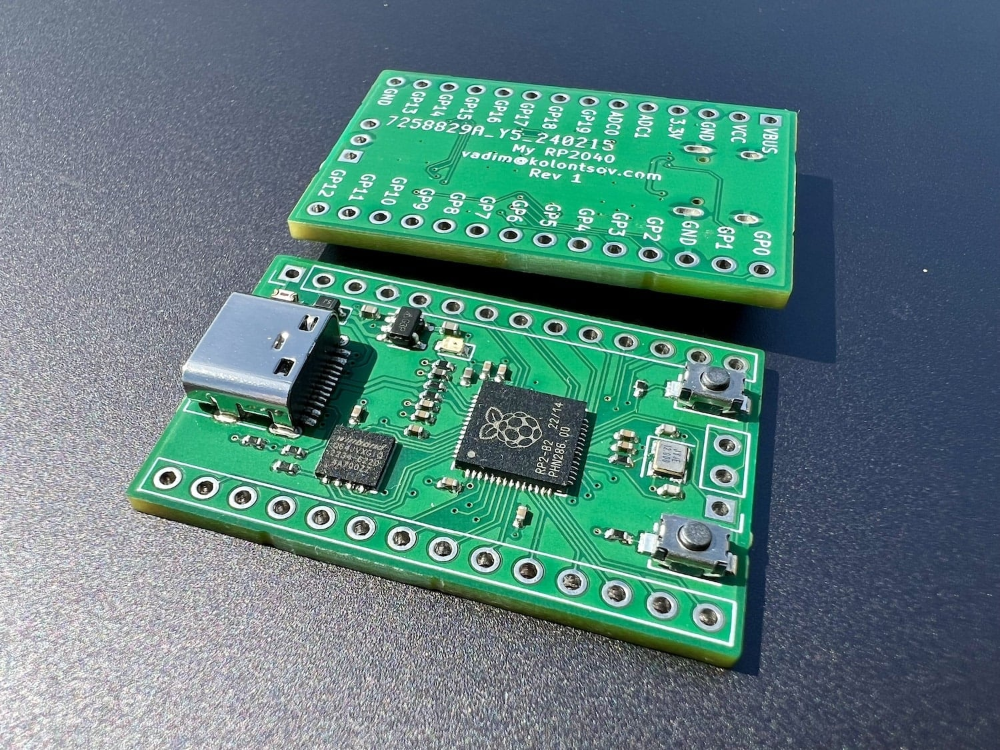
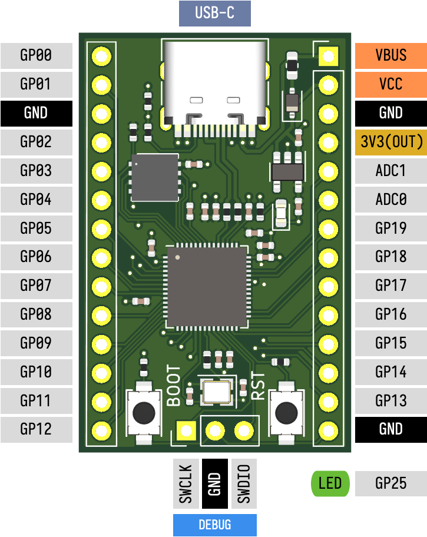

# My-RP2040

A small [RP2040](https://datasheets.raspberrypi.com/rp2040/rp2040-datasheet.pdf) board, with USB-C, 8MB of flash, SWD interface, 22 GPIO, and a LED. Size: 24x37mm.

This board serves no special purpose other than being an exercise in designing an RP2040 board.

- Designed in KiCad 8, produced and assembled at [JLCPCB](https://jlcpcb.com/), confirmed to work.
- Follows recommendation from the [Hardware design with RP2040](https://datasheets.raspberrypi.com/rp2040/hardware-design-with-rp2040.pdf).
- Some footprints and 3D models are from my [personal library](https://github.com/kolontsov/kicad-lib).
- Uses [design rules](https://github.com/labtroll/KiCad-DesignRules) to match JLCPCB [capabilities](https://jlcpcb.com/capabilities/pcb-capabilities).
- Production files (Gerbers, BOM, and CPL) are generated with the help of the [KiCAD JLCPCB plugin](https://github.com/Bouni/kicad-jlcpcb-tools).

## Pinout

## License

Creative Commons (CC0-1.0). For the license text, see [LICENSE](LICENSE).

